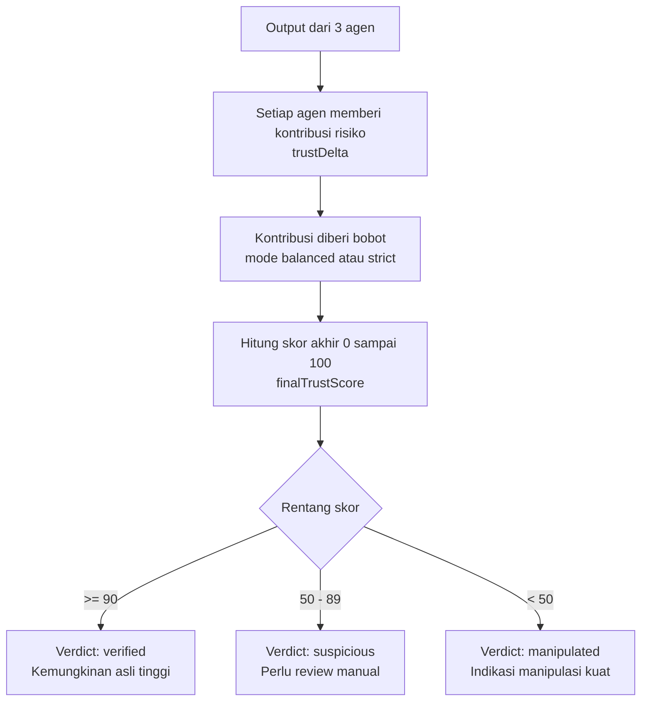

# Flowchart Cipher Sleuth (Versi Mudah Dipahami + Tetap Teknis)

Dokumen ini menjelaskan alur kerja project dengan bahasa yang lebih ramah untuk orang awam, sambil tetap menjaga konteks teknis inti.

## 1) Alur Utama Sistem (Dari Upload Sampai Hasil)

```mermaid
flowchart LR
  A[Pengguna upload gambar] --> B[Browser menyiapkan file<br/>konversi jika perlu ke WEBP]
  B --> C[API menerima request<br/>POST /api/analyze]

  C --> D{Lolos validasi awal?\nformat, ukuran, payload}
  D -- Tidak --> X1[Stop: kirim error\n400 413 415]
  D -- Ya --> E{Pengguna Guest?}

  E -- Ya --> F[Proteksi Guest\nCaptcha + limit IP harian]
  F --> G{Lolos proteksi?}
  G -- Tidak --> X2[Stop: kirim error\n403 429 503]
  G -- Ya --> H[Cek hash gambar\n(duplicate detection)]

  E -- Tidak --> H

  H --> I{Hash sudah pernah dianalisis?}
  I -- Ya --> J[Pakai hasil lama\nsource=cache]
  I -- Tidak --> K[Jalankan 3 agen forensik paralel]

  K --> K1[Agent Metadata\nEXIF]
  K --> K2[Agent ELA\nanalisis pola kompresi]
  K --> K3[Agent Integritas\nDWT-SVD heuristic]

  K1 --> L[Gabungkan hasil\nTrust Score + Verdict]
  K2 --> L
  K3 --> L

  J --> M[Buat ringkasan laporan\nLLM orchestrator atau fallback deterministic]
  L --> M

  M --> N[Simpan hasil\nSession store + Supabase]
  N --> O[Kirim response ke UI]
  O --> P[Pengguna lihat hasil\nscore, verdict, ringkasan, ELA heatmap]
  P --> Q[Pengguna bisa unduh PDF report]
```

## 2) Alur Pembuatan Skor (Trust Score)



## 3) Alur Download Laporan PDF

```mermaid
flowchart TD
  A[User klik Download Report] --> B[GET /api/report/{analysisId}]
  B --> C[Redirect 307 ke\n/api/report/{analysisId}/pdf]
  C --> D[Cari data analisis di session store\nin-memory]
  D --> E{Data ditemukan?}

  E -- Tidak --> X1[404\nReport not found or expired]
  E -- Ya --> F[Validasi kepemilikan sesi\nuserId atau guest cookie]
  F --> G{Authorized?}

  G -- Tidak --> X2[403\nUnauthorized report access]
  G -- Ya --> H[Generate PDF dari data forensik]
  H --> I[Return file PDF\nContent-Type application/pdf]
```

## 4) Glosarium Singkat

- `EXIF`: metadata gambar (contoh: software edit, kamera, timestamp).
- `ELA`: teknik melihat perbedaan pola kompresi untuk indikasi tempelan/manipulasi.
- `Trust Score`: skor kepercayaan 0-100 hasil gabungan semua agen.
- `Duplicate detection`: cek hash SHA-256 untuk tahu gambar sudah pernah dianalisis atau belum.
- `Cache`: jika hash sama, sistem pakai hasil lama supaya lebih cepat.
- `Fallback deterministic`: ringkasan non-LLM jika LLM dimatikan/gagal.
- `Session store (in-memory)`: penyimpanan sementara selama proses/server masih aktif.

## 5) Catatan Praktis untuk Non-Teknis

- Kalau upload gagal di awal, biasanya karena format/ukuran file tidak sesuai.
- Kalau request guest ditolak, biasanya karena captcha belum valid atau kuota harian IP habis.
- Jika gambar sama diupload lagi, hasil bisa keluar lebih cepat karena mengambil dari cache.
- PDF report hanya bisa diunduh oleh sesi yang berhak (pemilik analisis).
